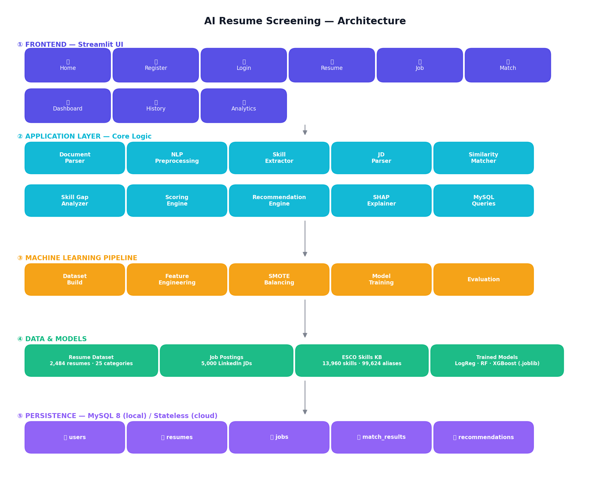
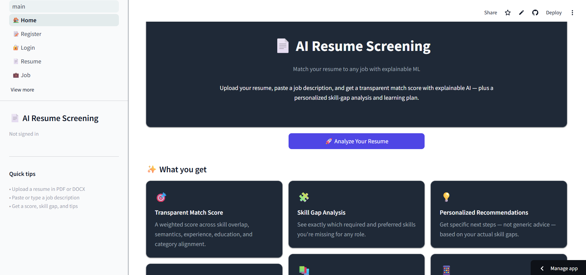
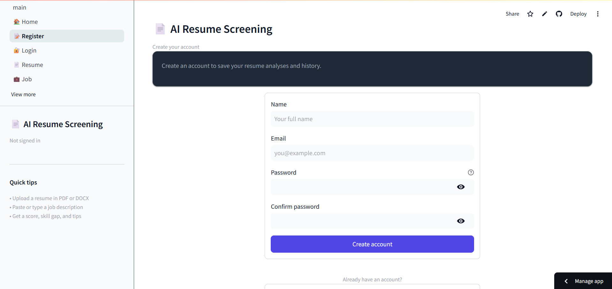
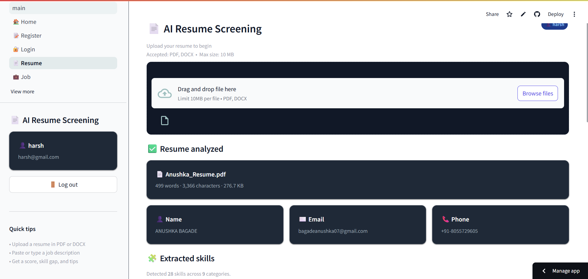
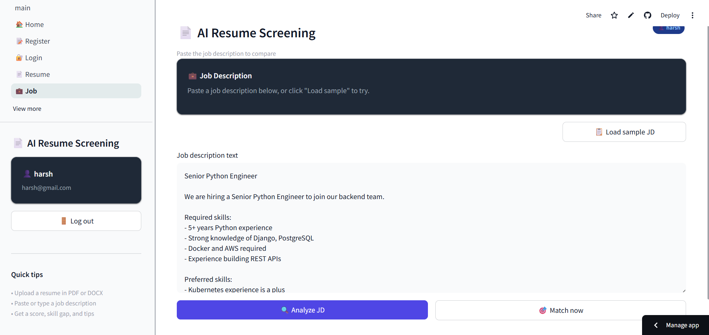
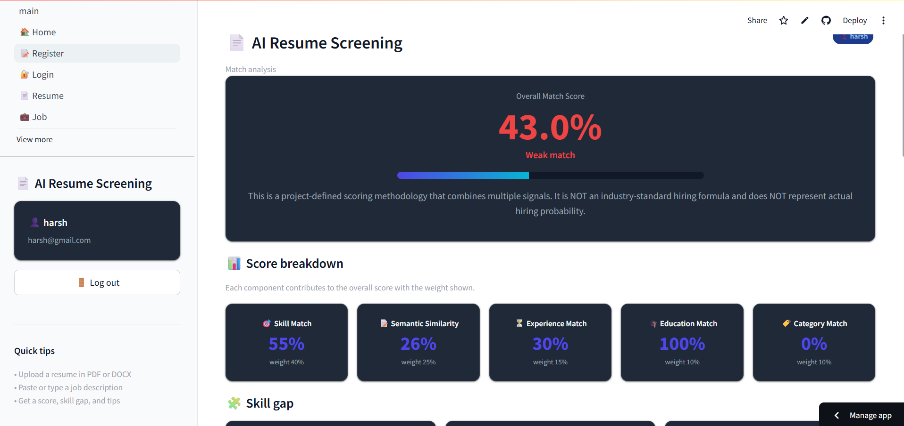
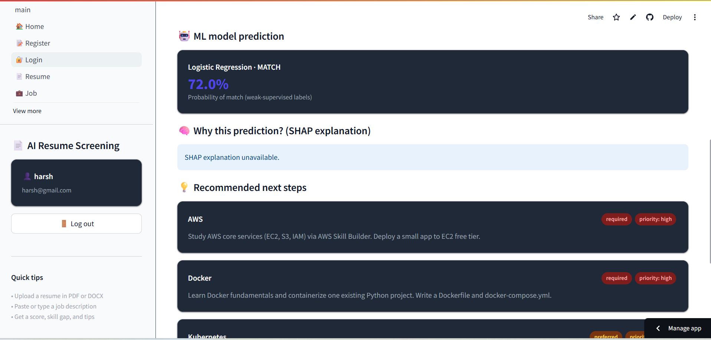
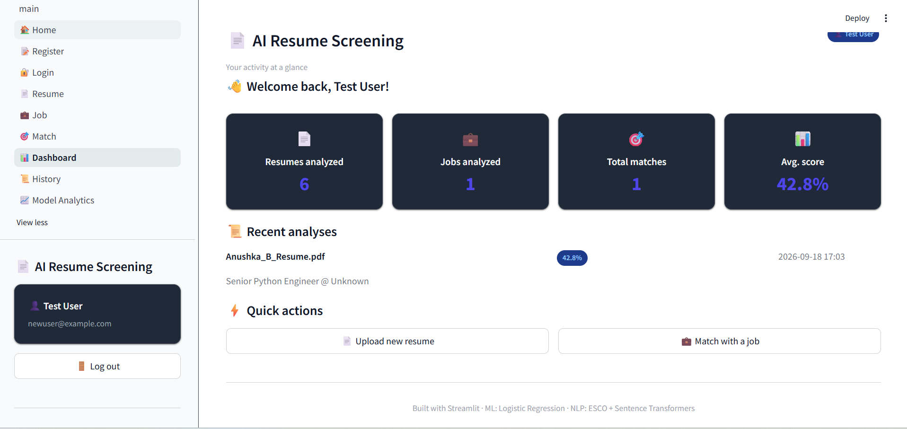
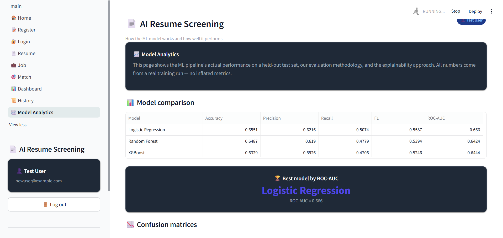
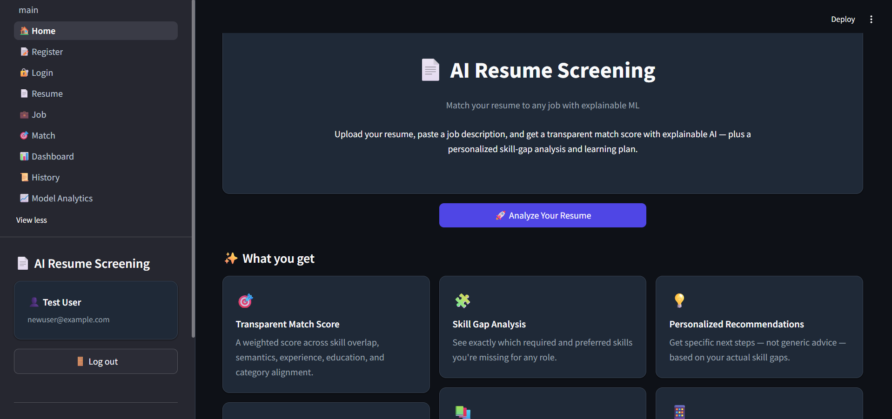

# 📄 AI Resume Screening & Job Matching System

> An end-to-end, explainable ML system that analyzes resumes, parses job descriptions, and returns a transparent match score with skill gap analysis and personalized recommendations.

[](https://www.python.org/)
[](https://streamlit.io/)
[]()
[]()

**🔗 Live Demo:** [resume-screening-ai.streamlit.app](https://resume-screening-ai-4alf5t2k5ghlfkm6wpzmry.streamlit.app)

---

## 📌 Overview

The **AI Resume Screening & Job Matching System** is a full-stack machine learning application that automates the process of matching candidate resumes against job descriptions. It combines:

- **NLP** for text extraction, skill identification, and semantic similarity
- **Classical ML** (Logistic Regression) trained on weakly-supervised labels
- **Explainable AI** (SHAP) for transparent predictions
- **A responsive Streamlit UI** deployed to the cloud

The system does **not** claim to replicate real-world hiring decisions. It provides a **transparent, project-defined matching score** with a full breakdown of contributing factors.

---

## ❓ Problem Statement

Recruiters spend hours manually screening resumes against job requirements. Candidates have little visibility into why they match (or don't) for a role. Existing tools are either black-box or overfit to keywords.

**This project aims to:**
- Automate resume–JD matching with a **transparent, weighted score**
- Surface **skill gaps** (required vs. preferred) for the candidate
- Generate **personalized learning recommendations** based on actual gaps
- Explain every prediction using **SHAP values**

---

## ✨ Features

- 📄 **Resume upload** — PDF and DOCX support with robust parsing
- 🧩 **Skill extraction** — 14,000+ skills from ESCO + a curated catalog
- 💼 **Job description parsing** — extracts title, required/preferred skills, experience, education
- 🎯 **Transparent match score** — 5 weighted components (skill, semantic, experience, education, category)
- 🔍 **Skill gap analysis** — matched, missing required, missing preferred
- 🧠 **Explainable AI** — SHAP shows *why* a prediction was made
- 💡 **Recommendation engine** — curated learning paths based on actual gaps
- 📊 **Dashboard + History** — track analyses over time (with MySQL)
- 📈 **Model Analytics** — ROC curves, confusion matrices, methodology
- 🌓 **Dark + light mode** — auto-detects system preference
- 📱 **Fully responsive** — desktop, tablet, mobile

---


````markdown
## 🏗️ Architecture



## 🛠️ Tech Stack

| Layer | Technology |
|-------|-----------|
| **Language** | Python 3.11 |
| **Data Processing** | Pandas, NumPy |
| **Machine Learning** | scikit-learn (LogisticRegression, RandomForest), XGBoost |
| **Imbalance Handling** | imbalanced-learn (SMOTE) |
| **NLP** | NLTK, TF-IDF, Sentence Transformers (`all-MiniLM-L6-v2`) |
| **Skill Taxonomy** | ESCO (European Commission), curated catalog |
| **Explainability** | SHAP |
| **Document Parsing** | pypdf, python-docx |
| **Visualization** | Matplotlib, Seaborn |
| **Web App** | Streamlit |
| **Database** | MySQL 8 via `mysql-connector-python` |
| **Security** | bcrypt (password hashing), python-dotenv |
| **Testing** | pytest (234 tests) |
| **Deployment** | Streamlit Community Cloud |

---

## 📊 Datasets

| Dataset | Source | Size | Usage |
|---------|--------|------|-------|
| **Resume Dataset** | [Kaggle — snehaanbhawal/resume-dataset](https://www.kaggle.com/datasets/snehaanbhawal/resume-dataset) | 2,484 resumes across 25 categories | Resume parsing, skill extraction, ML training |
| **LinkedIn Job Postings** | [Kaggle — arshkon/linkedin-job-postings](https://www.kaggle.com/datasets/arshkon/linkedin-job-postings) | 5,000 sampled postings | JD parsing, matching |
| **ESCO Skills** | [European Commission](https://esco.ec.europa.eu/en/use-esco/download) | 13,960 skills, 99,624 alias entries | Skill normalization, categorization |

**License notes:**
- Resume + LinkedIn datasets: **CC0 Public Domain**
- ESCO: free with attribution (**CC BY 4.0**)

No datasets are stored in this repo (except ESCO's cleaned skills file, which is small). Run `data/README.md` for the download scripts.

---

## 🧠 ML Methodology

### Weak supervision for labels

Since no public dataset exists with human-labeled "resume-JD match" pairs, we used **weak supervision**:

1. Sample 3,000 (resume, JD) pairs from the raw datasets
2. For each pair, compute **TF-IDF cosine similarity** between the texts
3. Auto-calibrate thresholds from the observed distribution:
   - Top 30% similarity → **label 1 (match)**
   - Bottom 40% → **label 0 (no match)**
   - Middle 30% → **skipped as ambiguous**
4. **2,101 labeled pairs** remained

**This is honest weak supervision** — labels come from an automated heuristic, not human annotation. It scales but introduces label noise, which is why model performance tops out around ROC-AUC 0.67–0.70 rather than 0.95+.

### Feature engineering

Five features per pair, all **independent of the label source** to prevent leakage:

| Feature | Description |
|---------|-------------|
| `skill_match_score` | Overlap of resume skills vs. all JD skills |
| `skill_match_required` | Overlap vs. JD required skills only |
| `experience_match` | Resume years vs. JD requirement |
| `education_match` | Resume degree vs. JD requirement |
| `category_match` | Resume category vs. JD title keywords |

### Model training

- **Split:** 70% train / 15% validation / 15% test (stratified)
- **Imbalance:** ~57% no-match / 43% match
- **Fix:** SMOTE on the **training fold only** (never validation or test)
- **Regularization:** `class_weight="balanced"` on all models
- **Models compared:** Logistic Regression, Random Forest, XGBoost

### Results (held-out test set, 316 samples)

| Model | Accuracy | Precision | Recall | F1 | ROC-AUC |
|-------|----------|-----------|--------|-----|---------|
| **Logistic Regression** 🏆 | 0.6551 | 0.6216 | 0.5074 | 0.5587 | **0.6660** |
| Random Forest | 0.6487 | 0.6190 | 0.4779 | 0.5394 | 0.6424 |
| XGBoost | 0.6329 | 0.5926 | 0.4706 | 0.5246 | 0.6444 |

**Logistic Regression wins** — the tree-based models overfit the noisy weak labels (train AUC ~0.92, val AUC ~0.67), while Logistic Regression generalizes better and is fully interpretable via SHAP.

### Data leakage we caught

Early models scored **100% accuracy on every metric** — a red flag. The cause: `length_ratio` (a length-similarity feature) was correlated with TF-IDF similarity, which was also the label source. The model wasn't learning — it was copying the label.

**Fix:** Removed the leaky feature. ROC-AUC dropped from 0.73 to 0.67 — but the resulting model is honest and its SHAP explanations are trustworthy.

**Lesson:** Perfect accuracy on noisy data is almost always data leakage. **SHAP is not just a reporting tool — it's a diagnostic.**

### Explainable AI (SHAP)

Every prediction is explained with `shap.LinearExplainer`:

- **Global importance** — which features matter most on average
- **Local contribution** — for a single prediction, which features pushed toward match vs. no-match and by how much

SHAP surfaced the leakage bug — `length_ratio` dominated the model despite having no real-world meaning for hiring.

---

## 📸 Screenshots

### Home page


### Register


### Resume analysis


### Job description


### Match results — score & breakdown


### Match results — SHAP & recommendations


### Dashboard


### Model Analytics


### Dark mode


---

## 🚀 Run Locally

### Prerequisites

- Python **3.11** (3.12/3.13 also work but with minor package caveats)
- MySQL 8 (optional — the app works in stateless mode without it)

### Steps

```bash
# 1. Clone the repository
git clone https://github.com/bagadeanushka07-a11y/resume-screening-ai.git
cd resume-screening-ai

# 2. Create and activate a virtual environment
python -m venv venv

# Windows
venv\Scripts\activate
# macOS / Linux
source venv/bin/activate

# 3. Install dependencies
pip install -r requirements.txt

# 4. Set up environment variables
cp .env.example .env
# Edit .env to add your MySQL credentials (optional)

# 5. (Optional) Set up MySQL
mysql -u root -p -e "CREATE DATABASE IF NOT EXISTS resume_screening;"
python -m src.ml.build_dataset   # only if data files missing
python -m src.ml.train

# 6. Run the app
streamlit run app/main.py
```

The app will open at `http://localhost:8501`.

### Running tests

```bash
pytest tests/ -v
```

**234 tests** covering parsing, NLP, ML, database, and the recommendation engine.

---

## 📁 Project Structure

```
resume-screening-ai/
├── app/                            # Streamlit UI
│   ├── main.py                     # Entry point
│   ├── components/                 # Reusable UI + logic components
│   │   ├── auth.py                 # Login/register helpers
│   │   ├── file_upload.py          # Resume upload widget
│   │   ├── match_flow.py           # End-to-end match orchestration
│   │   ├── navbar.py, sidebar.py   # Navigation
│   │   ├── scoring.py              # Weighted match scoring
│   │   └── styles.py               # Responsive + theme CSS
│   ├── config/config.py            # Constants, session keys, paths
│   └── pages/                      # 9 pages (auto-routed by Streamlit)
│       ├── 1_🏠_Home.py
│       ├── 2_📝_Register.py
│       ├── 3_🔐_Login.py
│       ├── 4_📄_Resume.py
│       ├── 5_💼_Job.py
│       ├── 6_🎯_Match.py
│       ├── 7_📊_Dashboard.py
│       ├── 8_📜_History.py
│       └── 9_📈_Model_Analytics.py
│
├── src/                            # Core logic
│   ├── preprocessing/
│   │   ├── document_parser.py      # PDF/DOCX → text
│   │   └── text_cleaner.py         # Multi-view NLP preprocessing
│   ├── nlp/
│   │   ├── skill_kb.py             # ESCO + curated skill KB
│   │   ├── skill_extractor.py      # Resume/JD skill extraction
│   │   ├── jd_parser.py            # Structured JD parsing
│   │   ├── tfidf_matcher.py        # TF-IDF similarity
│   │   └── embeddings.py           # Sentence-transformer similarity
│   ├── ml/
│   │   ├── feature_engineering.py  # 5-feature extraction
│   │   ├── build_dataset.py        # Weak supervision pipeline
│   │   ├── train.py                # Train 3 models
│   │   ├── evaluate.py             # Test set evaluation
│   │   └── explain.py              # SHAP explanations
│   ├── matching/
│   │   └── skill_gap.py            # Weighted skill gap analysis
│   ├── recommendations/
│   │   └── recommendation_engine.py # Template-based recommendations
│   └── database/
│       ├── connection.py           # MySQL connection + schema
│       └── queries.py              # CRUD operations
│
├── tests/                          # 234 pytest tests
├── data/
│   ├── raw/                        # (ignored) raw downloads
│   ├── processed/                  # Cleaned datasets + ESCO
│   └── external/                   # Curated skill + recommendation catalogs
├── models/                         # Trained .joblib models
├── reports/                        # Evaluation plots + metrics
├── notebooks/                      # EDA + cleaning notebooks
├── docs/screenshots/               # README screenshots
├── .streamlit/config.toml          # Theme + server config
├── requirements.txt
└── README.md
```

---

## ⚠️ Limitations & Honest Notes

- **Weak labels:** ML labels come from TF-IDF similarity, not human annotation. This caps ROC-AUC at ~0.67 — a real number, not inflated.
- **No hiring probability:** The match score is a project-defined weighted formula. It does **not** represent actual hiring likelihood.
- **ESCO limitations:** ESCO includes domain terms (e.g. "computer science") that aren't strictly "skills." A small blacklist could refine this in v2.
- **Stateless cloud deploy:** Streamlit Community Cloud has no MySQL, so the deployed demo runs in stateless mode. Full persistence works locally.
- **Model performance:** ROC-AUC 0.666 is modest because the labels are noisy. Better labels (human-annotated) would improve this materially.

---

## 🔮 Future Scope

- **Human-annotated labels** — replace weak supervision with real recruiter judgments
- **Fine-tuned transformer** — instead of averaged TF-IDF + MiniLM, fine-tune a domain-specific encoder on resume-JD pairs
- **Skill importance weighting** — currently all required skills are weighted equally; some JDs prioritize certain skills
- **Multi-resume ranking** — score one JD against many resumes and rank candidates
- **Real cloud MySQL** — integrate Aiven or PlanetScale for persistent history on the cloud deploy
- **Resume feedback mode** — rewrite suggestions (e.g. "add Kubernetes to your skills section")

---

## 📚 References

- **ESCO Taxonomy** — European Commission, https://esco.ec.europa.eu/
- **Sentence Transformers** — Reimers & Gurevych (2019), [arXiv:1908.10084](https://arxiv.org/abs/1908.10084)
- **SHAP** — Lundberg & Lee (2017), [arXiv:1705.07874](https://arxiv.org/abs/1705.07874)
- **SMOTE** — Chawla et al. (2002), [JAIR 16](https://www.jair.org/index.php/jair/article/view/10302)
- **Weak Supervision** — Ratner et al. (2017), [arXiv:1605.07723](https://arxiv.org/abs/1605.07723)

---

## 👤 Author

**Anushka Bagade**
Computer Engineering, 3rd year

- **GitHub:** [@bagadeanushka07-a11y](https://github.com/bagadeanushka07-a11y)
- **Live Demo:** [resume-screening-ai.streamlit.app](https://resume-screening-ai-4alf5t2k5ghlfkm6wpzmry.streamlit.app)

---

## 📄 License

This project is licensed under the MIT License. See [LICENSE](LICENSE) for details.

---

⭐ **If you found this project useful, please consider giving it a star!**